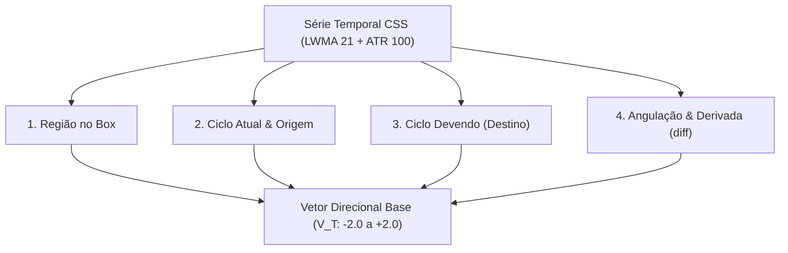
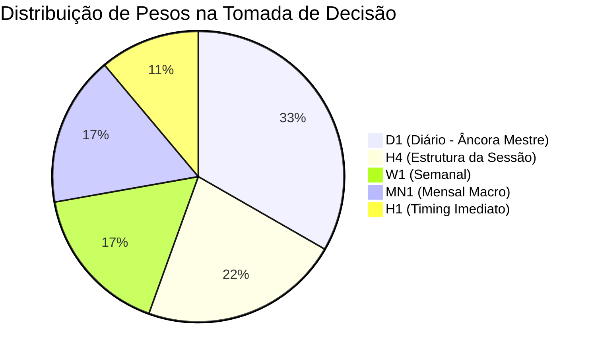
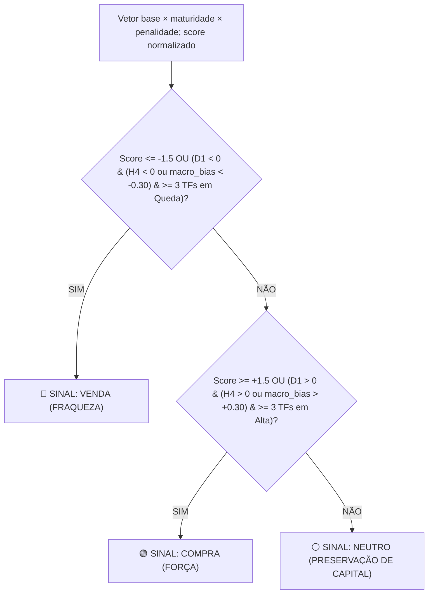
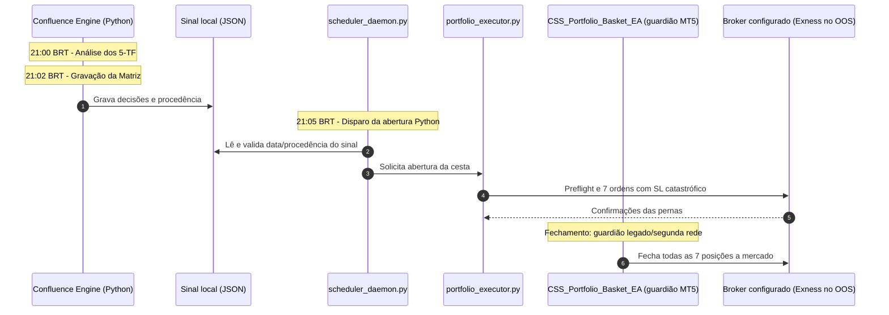

# Matriz Institucional de Confluência Multi-Timeframe e Motor de Decisão Direcional

Documentação técnica oficial do algoritmo de tomada de decisão para a escolha de direção (**COMPRA / FORÇA**, **VENDA / FRAQUEZA** ou **NEUTRO / PRESERVAÇÃO**) no ecossistema **CSS Institutional Platform**.

---

## 1. Filosofia Operacional & Superação de Filtros Estáticos

Diferente de abordagens ingênuas que olham apenas para o valor estático do score (ex: assumir que todo score positivo é compra e todo negativo é venda), o motor institucional avalia a **dinâmica cíclica vetorial**:

> [!IMPORTANT]
> **Princípio da Reversão em Topos e Fundos:**
> * Uma moeda com score alto em **Zona Verde ($\ge +0.20$)** que começa a inclinar para baixo ($\text{diff} < 0$) está em **Exaustão de Compra / Virada no Topo**. Isso constitui um dos sinais mais fortes e precoces de **VENDA**, antes mesmo do score cruzar a Linha Zero!
> * Uma moeda em **Zona Vermelha ($\le -0.20$)** que começa a inclinar para cima ($\text{diff} > 0$) está em **Exaustão de Venda / Virada no Fundo**, constituindo sinal de **COMPRA**.

---

## 2. Tríade Analítica dos 4 Pilares por Timeframe

Para cada um dos 5 timeframes analisados ($\text{MN1}, \text{W1}, \text{D1}, \text{H4}, \text{H1}$), o sistema decompõe a série temporal nos seguintes pilares:

### Classificação do Vetor Direcional Base ($V_T$):

| Condição Estrutural | Região e Derivada | Vetor ($V_T$) | Classificação Institucional |
| :--- | :---: | :---: | :--- |
| **Reversão de Topo** | Score $\ge +0.20$ e $\text{diff} \le -0.03$ | **$-2.0$** | 🔴 Venda Forte (Virada no Topo) |
| **Reversão de Fundo** | Score $\le -0.20$ e $\text{diff} \ge +0.03$ | **$+2.0$** | 🟢 Compra Forte (Virada no Fundo) |
| **Topo em queda** | Score $\ge +0.20$ e $-0.03 < \text{diff} < 0$ | **$-1.5$** | 🔴 Venda no topo |
| **Fundo em alta** | Score $\le -0.20$ e $0 < \text{diff} < +0.03$ | **$+1.5$** | 🟢 Compra no fundo |
| **Topo sem queda** | Score $\ge +0.20$ e $\text{diff}=0$ | **$-0.5$** | ⚠️ Exaustão compradora |
| **Fundo sem alta** | Score $\le -0.20$ e $\text{diff}=0$ | **$+0.5$** | ⚠️ Exaustão vendedora |
| **Fluxo forte fora do extremo/equilíbrio** | $|Score| > 0.05$ e $|\text{diff}| \ge 0.05$ | **$\pm1.0$** | 🔻/🔺 Aceleração no box |
| **Fluxo moderado fora do extremo/equilíbrio** | $|Score| > 0.05$ e $0.002 < |\text{diff}| < 0.05$ | **$\pm0.5$** | 🔻/🔺 Fluxo no box |
| **Equilíbrio / lateral** | $-0.05 \le Score \le +0.05$ e $|\text{diff}| \le 0.002$ | **$0.0$** | ⚪ Neutro / Sem Direção |

Quando o score está entre $-0.05$ e $+0.05$, a regra de equilíbrio vem antes
da regra de intensidade: uma derivada acima de $0.002$ ou abaixo de
$-0.002$ produz $+0.40$ ou $-0.40$. Os valores da tabela são o vetor base;
o vetor efetivo ainda recebe maturação temporal e, quando aplicável, a
penalidade de contra-fluxo descritas abaixo.

---

## 3. Hierarquia Ponderada com Soberania do Diário (D1)

Os timeframes possuem pesos hierárquicos específicos, refletindo sua importância estrutural para o pregão noturno das **21:05 às 08:00 BRT**:

$$\text{Score Ponderado} = (V_{D1} \times \mathbf{3.0}) + (V_{H4} \times \mathbf{2.0}) + (V_{W1} \times \mathbf{1.5}) + (V_{MN1} \times \mathbf{1.5}) + (V_{H1} \times \mathbf{1.0})$$

* **Soma dos pesos = $9.0$**. O denominador $13.5$ é o denominador normativo
  preservado do commit `544d660`, não a soma dos pesos.
* **Score Normalizado:**
$$\text{Norm Score} = \frac{\text{Score Ponderado}}{13.5} \times 10.0$$

O cálculo executado é, na ordem:

$$V_T^{efetivo} = V_T \times M_T \times P_T$$
$$\text{Score Ponderado} = \sum_T (V_T^{efetivo} \times peso_T)$$

Para D1, H4 e H1, $M_T=1.00$. Para W1, a maturação é $0.20$ na
segunda-feira, $0.40$ na terça, $0.60$ na quarta, $0.80$ na quinta e $1.00$
de sexta a domingo. Para MN1, $M_T=\min(1.00,\max(0.20,\text{dia}/30))$.
Quando $macro\_bias>0.30$, vetores operacionais negativos recebem
$P_T=0.40$; quando $macro\_bias<-0.30$, vetores operacionais positivos
recebem $P_T=0.40$. Nos demais casos, $P_T=1.00$.

---

## 4. Regras de Decisão Direcional

### 1. Critério de Venda (`SELL`):
* $\text{Score Normalizado} \le -1.5$ **OU**
* $V_{D1}^{efetivo} < 0$ acompanhado de $V_{H4}^{efetivo} < 0$ ou
  $macro\_bias < -0.30$, com no mínimo **3 timeframes em queda**.
* *Rotulação:*
  * Se 5 timeframes alinhados: `CONFLUÊNCIA TOTAL DE QUEDA (5-TF ALINHADOS)`
  * Se 3 a 4 timeframes: `CONFLUÊNCIA DE QUEDA (X/5 TIMEFRAMES)`

### 2. Critério de Compra (`BUY`):
* $\text{Score Normalizado} \ge +1.5$ **OU**
* $V_{D1}^{efetivo} > 0$ acompanhado de $V_{H4}^{efetivo} > 0$ ou
  $macro\_bias > +0.30$, com no mínimo **3 timeframes em alta**.

Antes dessas regras gerais, uma retomada macro pode produzir `COMPRA` quando
$macro\_bias>+0.30$, há contra-fluxo em D1 ou H4 e $H1>0$; a regra simétrica
produz `VENDA` quando $macro\_bias<-0.30$, há contra-fluxo em D1 ou H4 e
$H1<0$.
* *Rotulação:*
  * Se 5 timeframes alinhados: `CONFLUÊNCIA TOTAL DE ALTA (5-TF ALINHADOS)`
  * Se 3 a 4 timeframes: `CONFLUÊNCIA DE ALTA (X/5 TIMEFRAMES)`

### 3. Critério de Neutralidade (`NEUTRAL`):
* Timeframes conflitantes (ex: D1 em alta mas H4 e H1 em queda) ou mercado lateral sem angulação mínima. O robô é **bloqueado para proteger o capital**.

---

## 5. Estudo de Caso Real: O Euro (EUR)

Abaixo demonstramos o cálculo exato executado pelo motor de confluência para o
Euro em `ref_dt = 2026-08-28T21:00:00-03:00` (BRT). As derivadas são
exemplificativas e escolhidas para produzir os vetores base indicados; a
maturação e a penalidade são aplicadas pelo motor antes da ponderação.

| Timeframe | Região & Score | Derivada ($\text{diff}$) | Vetor ($V_T$) | Peso | Subtotal |
| :---: | :---: | :---: | :---: | :---: | :---: |
| **MN1** | $+0.33$ (Zona Verde $\ge +0.20$) | $\text{diff}=-0.01$ (Topo em queda) | $-1.5 \times 0.93 = -1.395$ | $1.5$ | $-2.0925$ |
| **W1** | $-0.09$ (Box Inferior) | $\text{diff}=-0.05$ (Fluxo forte) | $-1.0 \times 1.00 = -1.0$ | $1.5$ | $-1.50$ |
| **D1** | $+0.13$ (Box Superior) | $\text{diff}=-0.05$ (Fluxo forte) | $-1.0 \times 1.00 = -1.0$ | **$3.0$** | **$-3.00$** |
| **H4** | $+0.02$ (Equilíbrio) | $\text{diff}=-0.05$ (derivada no box) | $-0.40 \times 1.00 = -0.40$ | $2.0$ | $-0.80$ |
| **H1** | $-0.62$ (Extremo Inferior) | $\text{diff}=-0.05$ (Fluxo forte) | $-1.5 \times 1.00 = -1.5$ | $1.0$ | $-1.50$ |

$$\text{Score Ponderado Total} = -2.0925 - 1.50 - 3.00 - 0.80 - 1.50 = \mathbf{-8.8925}$$
$$\text{Score Normalizado} = \frac{-8.8925}{13.5} \times 10.0 = \mathbf{-6.59}$$

**Decisão do Sistema:**
* **Direção:** `SELL` (Venda Institucional)
* **Veredito:** `VENDA FORTE (FLUXO INSTITUCIONAL COMPLETO)`
* **Confluência:** `5 de 5 Timeframes Alinhados para Queda`

---

## 6. Integração com a Execução dos Robôs MT5

O caminho padrão de abertura é Python (scheduler e executor). O EA não é o
dono da abertura nesta arquitetura; `InpEaOpensBasket=true` é um caminho legado
não adotado e não deve ser habilitado junto com a abertura Python.

---

## 7. Ranking atual e limites do contrato

O motor Port A decide `trade_bias` por moeda. O consumidor web também mantém um
screener separado dos 28 pares, ainda baseado na função legada
`evaluate_28_pairs_confluence` e nos sinais intraday D1/H4/H1. Não existe, neste
escopo, um ranking persistido de 1º a 8º moedas nem um contrato de pódio
multiplataforma.

Qualquer ordenação por magnitude absoluta, pódio ou destaque visual mencionado
em discussões futuras é apenas conceito não implementado; não representa saída
atual nem contrato operacional.

### Estrutura observada:
1. **Decisão por moeda:** `currencies[]` expõe `total_score` (alias público de
   `score_total`), `trade_bias`, estado e veredito. Os diagnósticos internos
   da matriz 5-TF (`macro_bias`, `vectors`, `base_vectors`, `maturities`,
   `penalties`, `weighted_score`, `macro`/`operational` completos) ficam só no
   retorno interno de `evaluate_currency_confluence` — não são serializados
   neste payload; ver `docs/plans/port-upstream-institutional-matrix.md`,
   seção "Schema e visibilidade dos resultados", e a regressão
   `tests/test_css_service_port_a.py::test_api_css_all_public_schema_separates_currency_and_pair_scores`.
2. **Screener de pares:** `pairs[]` expõe a ordenação de 28 pares e seus
   campos de recomendação/alicate derivados do consumidor legado.
3. **Contrato futuro:** um ranking de moedas, `rank_position`, `is_podium` e
   eventuais destaques visuais só devem ser documentados como implementados
   depois que produtores, consumidores e testes forem adicionados.
