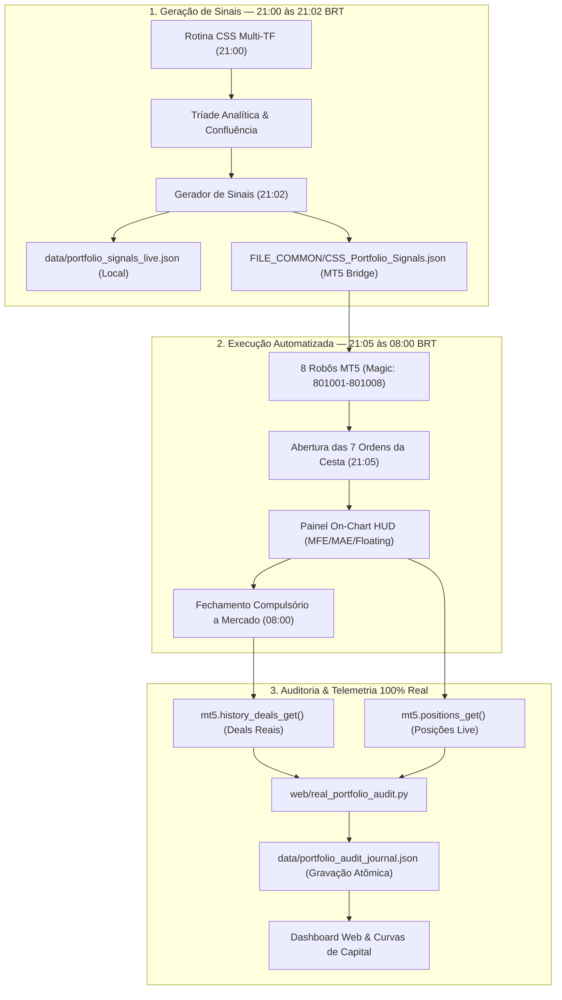

# Sistema de Gestão de Portfólios Multi-Moeda MT5 & Auditoria Institucional (21h ➔ 08h)

## 1. Visão Geral da Arquitetura

O sistema opera na metodologia de **Cestas Institucionais de 7 Pares** para cada uma das 8 principais moedas globais (*USD, EUR, GBP, CHF, JPY, AUD, CAD, NZD*), eliminando riscos de exposição direcional a um único par e aproveitando fluxos de capital macroeconômicos validados pelo indicador **CSS (Currency Slope Strength)**.



---

## 2. Cronologia e Regras Operacionais Rígidas

| Horário (BRT) | Evento / Ação | Descrição |
| :--- | :--- | :--- |
| **21:00:00** | **Cálculo CSS Multi-TF** | Leitura de preços e inclinações nos 5 timeframes (*MN1, W1, D1, H4, H1*). |
| **21:02:00** | **Gravação dos Sinais Oficiais** | Geração e gravação atômica do arquivo `CSS_Portfolio_Signals.json` em `FILE_COMMON`. |
| **21:05:00** | **Abertura das Cestas** | Os robôs lêem os sinais de suas moedas. Se `BUY` ou `SELL`, abrem simultaneamente os 7 pares a mercado. |
| **21:05 ➔ 07:59** | **Monitoramento e HUD** | Atualização contínua de PnL flutuante, pips acumulados, pico favorável (**MFE**) e drawdown máximo (**MAE**). |
| **08:00:00** | **Encerramento da Sessão** | Fechamento automático de todas as ordens abertas a mercado pelo Magic Number. |
| **08:05:00** | **Auditoria de Deals** | O motor de auditoria consolida os tickets reais do MT5 no journal oficial. |

---

## 3. Mapeamento de Moedas, Cestas (7 Pares) e Magic Numbers

Cada portfólio opera com **Magic Number exclusivo**, garantindo isolamento total de ordens:

| Moeda | Magic Number | Cor Oficial | Símbolo Gráfico Base | Pares Operados na Cesta |
| :--- | :---: | :---: | :---: | :--- |
| **USD** 🇺🇸 | `801001` | `#FF3B30` | `EURUSD` | EURUSD, GBPUSD, AUDUSD, NZDUSD, USDCAD, USDCHF, USDJPY |
| **EUR** 🇪🇺 | `801002` | `#2ECC71` | `EURGBP` | EURUSD, EURGBP, EURAUD, EURCAD, EURCHF, EURJPY, EURNZD |
| **GBP** 🇬🇧 | `801003` | `#3872FF` | `GBPJPY` | GBPUSD, EURGBP, GBPAUD, GBPCAD, GBPCHF, GBPJPY, GBPNZD |
| **CHF** 🇨🇭 | `801004` | `#00E5FF` | `USDCHF` | USDCHF, EURCHF, GBPCHF, AUDCHF, CADCHF, CHFJPY, NZDCHF |
| **JPY** 🇯🇵 | `801005` | `#9932CC` | `USDJPY` | USDJPY, EURJPY, GBPJPY, AUDJPY, CADJPY, CHFJPY, NZDJPY |
| **AUD** 🇦🇺 | `801006` | `#FF8C00` | `AUDUSD` | AUDUSD, EURAUD, GBPAUD, AUDCAD, AUDCHF, AUDJPY, AUDNZD |
| **CAD** 🇨🇦 | `801007` | `#E74C3C` | `USDCAD` | USDCAD, EURCAD, GBPCAD, AUDCAD, CADCHF, CADJPY, NZDCAD |
| **NZD** 🇳🇿 | `801008` | `#D2B48C` | `NZDUSD` | NZDUSD, EURNZD, GBPNZD, AUDNZD, NZDCAD, NZDCHF, NZDJPY |

### Regra de Inversão Direcional na Cesta:
* Se a decisão da moeda for **`BUY` (Força da Moeda)**:
  * Par onde a moeda é **BASE** (ex: `CADCHF` no portfólio CAD) ➔ **COMPRA (`BUY`)**
  * Par onde a moeda é **COTADA** (ex: `USDCAD` no portfólio CAD) ➔ **VENDA (`SELL`)**
* Se a decisão da moeda for **`SELL` (Fraqueza da Moeda)**:
  * Par onde a moeda é **BASE** ➔ **VENDA (`SELL`)**
  * Par onde a moeda é **COTADA** ➔ **COMPRA (`BUY`)**

---

## 4. Ponte de Comunicação Segura (Ida e Volta)

### Ponte de IDA (Python ➔ MT5 via `FILE_COMMON`)
* **Local:** `C:\Users\ryzen\AppData\Roaming\MetaQuotes\Terminal\Common\Files\CSS_Portfolio_Signals.json`
* **Formato JSON:**
```json
{
  "timestamp": "2026-08-22 21:02:00",
  "date": "2026-08-22",
  "portfolios": {
    "CAD": {
      "magic": 801007,
      "direction": "BUY",
      "status": "ACTIVE",
      "d1_score": 0.193,
      "h4_score": 0.112,
      "reason": "Confluência de Alta (Devendo Força +0.20)"
    }
  }
}
```
* **Leitura no MQL5:**
  O robô lê o arquivo via `FileOpen("CSS_Portfolio_Signals.json", FILE_READ | FILE_TXT | FILE_COMMON)` às 21:05. Se a moeda for `NEUTRAL`, nenhuma ordem é aberta.

### Ponte de VOLTA (MT5 ➔ Motor de Auditoria Real)
* **Auditoria de Deals:** O motor `web/real_portfolio_audit.py` consulta `mt5.history_deals_get()` filtrando estritamente pelos Magic Numbers `801001` a `801008`.
* **Zero Mocks:** Apenas operações reais concluídas no MT5 entram no cálculo de rentabilidade, win rate, drawdown e fator de lucro.
* **Persistência Atômica:** Gravações utilizam `tempfile` + substituição atômica no sistema operacional com backup diário automático em `data/backups/journal_backup_YYYY-MM-DD.json`.

---

## 5. Painel Visual On-Chart HUD no MT5

O robô projeta um display em tempo real no gráfico com informações auditáveis:

```
┌───────────────────────────────────────────────────────────┐
│  ⚡ PORTFÓLIO CSS — CAD [#801007]                        │
│  🟢 SESSÃO ENCERRADA (AGUARDANDO 21:05)                   │
│  Decisão das 21:02:  COMPRA FORTE                         │
│  Ordens no MT5:   0 / 7 pares                             │
│  PnL Flutuante:   +$0.00 USD (+0.0 pips)                  │
│  MFE (Pico Favorável):   +$0.00 USD                       │
│  MAE (Drawdown Máx):     -$0.00 USD                       │
│  🌐 Sincronizado com CSS Web Platform                     │
└───────────────────────────────────────────────────────────┘
```

---

## 6. Painel Web de Track Record & Curvas de Capital

Acesse **https://css-pro-mfc.web.app/** ➔ Botão **`📈 TRACK RECORD`**:

1. **🔴 Aba Ao Vivo:**
   * **Decisões das 21:02 BRT:** Cards das 8 moedas mostrando o viés do dia, Scores D1/H4, motivo analítico e Magic Number.
   * **Execução em Tempo Real:** PnL flutuante em USD, pips flutuantes, ordens abertas no MT5 e timer até 08:00 BRT.
2. **📋 Aba Auditoria de Sessões:**
   * Histórico auditado das noites anteriores com gaveta detalhada de cada um dos 7 pares e tickets reais do MT5.
3. **📊 Aba Curva de Capital & Analytics:**
   * **📈 Curva Consolidada:** Evolução de saldo de todos os portfólios operando em conjunto.
   * **🕸️ Curvas Individuais por Portfólio:** Curvas sobrepostas nas cores institucionais de cada moeda com toggles interativos para isolar qualquer moeda com 1 clique.
   * **Matriz Consolidada:** Ranking de rentabilidade, win rate e contagem de sessões.

---

## 7. Procedimentos de Operação e Manutenção

1. **Para Aplicar no MT5:**
   * Carregue o perfil **`CSS_Portfolios`** no menu `Arquivo ➔ Perfis ➔ CSS_Portfolios`.
   * Garanta que o botão **`Algo Trading`** na barra de ferramentas do MT5 esteja **ATIVADO (Verde)**.
2. **Reconfiguração Automática via Script:**
   * Em caso de instalação em um novo terminal MT5, execute:
     ```bash
     python scripts/setup_mt5_portfolios.py
     ```
3. **Sincronização Forçada de Deals:**
   * No modal da Web, clique no botão **`🔄 Recalcular / Sincronizar MT5`** para atualizar deals fechadas a qualquer momento.
